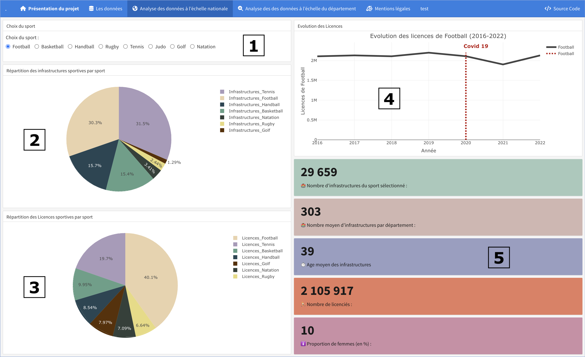
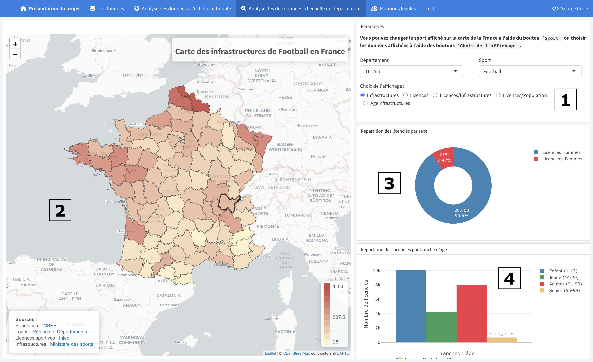
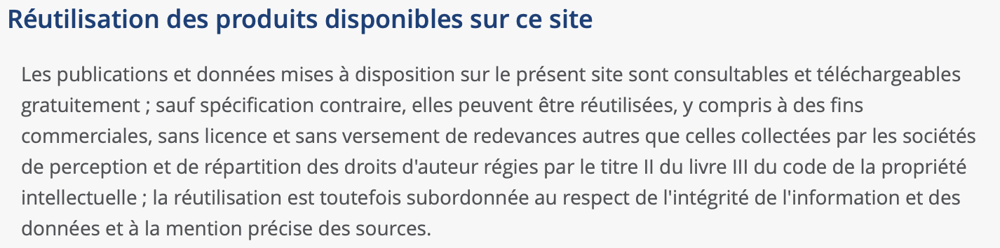
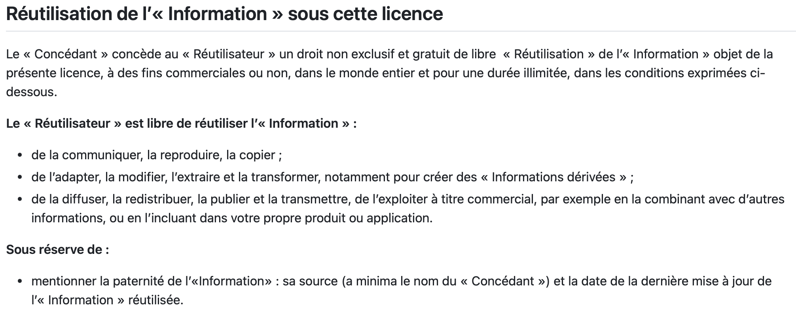
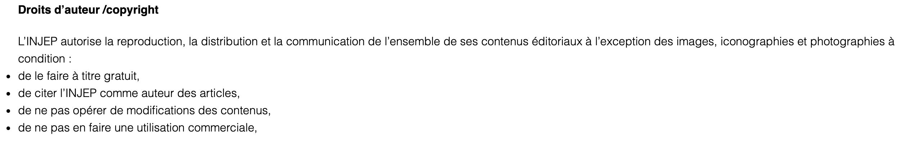

<!-- https://titouanlegourrierec.shinyapps.io/projet_visu/ -->


<!-- rsconnect::setAccountInfo(name='titouanlegourrierec', token='7319AF2A3409D2CA5422D00C6C109B28', secret='ZiP5VjMrdnrD2SKFIi8GcXRXG/Zl9XlwwbjnNKgD') -->
<!-- setwd("/Users/titouanlegourrierec/Desktop/Shiny_Projet_Visu") -->
<!-- rsconnect::deployApp() -->


```{r setup, include=FALSE}
# Chargement des bibliothèques
library(flexdashboard)
#library(shiny)
library(dplyr)
library(tidyr)
library(ggplot2)
library(plotly)
#library(reshape2)
#library(rAmCharts)
#library(rpart)
library(sf)
library(readr)
library(stringr)
library(leaflet)
#library(RColorBrewer)
library(DT)
```


```{r récupération des données, echo=FALSE}

################       Découpage des départements français      ################

# Lire les données du shapefile pour les départements français
france <- st_read("./France_shape/departements-20140306-100m.shp", quiet=T)

# Supprimer les colonnes inutiles du dataframe 'france'
france <- france[, !names(france) %in% c("nom", "nuts3", "wikipedia")]

################################################################################


################     Récupération des données de population     ################

# Lire les données de population pour les départements français
pop <- read_csv("./Populations_Departements/Departements.csv")

# Supprimer la première colonne du dataframe 'pop'
pop <- pop[, -1]

# Effectuer une jointure interne entre les dataframes 'france' et 'pop' basée sur la colonne 'code_insee'
carte_filtree <- inner_join(france, pop, by = "code_insee")

# Calculer les aires des départements et les convertir en kilomètres carrés
carte_filtree <- carte_filtree %>% mutate(aires = st_area(.))  
carte_filtree <- carte_filtree %>% mutate(aires = as.numeric(str_extract(aires, "\\d+")) / 1E6)

# Calculer la densité de population
carte_filtree["Densité"] <- carte_filtree["pop"]/carte_filtree["aires"]

################################################################################


########     Récupération des données des INFRASTRUCTURES sportives    #########

# Lire les données d'équipement sportif
sport_equipment <- read_csv("./Sport_Equipment/Sport_Equipment.csv")
sport_equipment <- sport_equipment[, !names(sport_equipment) %in% c("...1")]

################################################################################


###########     Récupération des données des LICENCES sportives    #############

# Lire les données de licences sportives
licences <-  read_csv("./Licences/AllPages.csv")
licences <- licences[, -1]

################################################################################

# Effectuer une jointure interne entre les dataframes 'carte_filtree' et 'sport_equipment' basée sur la colonne 'code_insee'
carte_sport <- inner_join(carte_filtree, sport_equipment, by = "code_insee")

# Effectuer une jointure interne entre les dataframes 'carte_sport' et 'licences' basée sur la colonne 'code_insee'
carte_sport <- inner_join(carte_sport, licences, by = "code_insee")

# Créer une nouvelle colonne 'code_nom' en combinant le code INSEE et le nom du département
carte_sport$code_nom <- paste(carte_sport$code_insee, carte_sport$nom, sep = " - ")

# Lire les données sur l'évolution des licences
evolution <- read_csv2("./Evolution_Licences/Licences_evolution.csv")
```


```{r formattage popup départements carte}
# Définir une fonction pour générer le contenu de la popup pour chaque département
popup_content <- function(properties, object) {
  
  # Extraire les données des infrastructures, des licences et de l'âge des infrastructures pour l'objet spécifié
  eval(parse(text = paste0("object2 <- carte_sport$", paste0("Infrastructures_", object))))
  eval(parse(text = paste0("object3 <- carte_sport$", paste0("Licences_", object))))
  eval(parse(text = paste0("object4 <- carte_sport$", paste0("AgeInfrastructures_", object))))
  
  # Supprimer les accents des noms de départements
  nom_sans_accents <- chartr(" áàâäãåéèêëíìîïóòôöõúùûüñç'", "-aaaaaaeeeeiiiiooooouuuunc-", properties$nom)
  
  # Générer l'URL pour l'image du logo du département
  image_url <- paste0("https://www.regions-et-departements.fr/images/logos-departements/",
                      properties$code_insee,
                      "-logo-",
                      tolower(nom_sans_accents),
                      ".png")
  
  # Remplacer les URLs pour les départements spécifiques (971, 972, 973, 974)
  special_departments <- properties$code_insee %in% c("971", "972", "973", "974")
  image_url[special_departments] <- paste0("https://www.regions-et-departements.fr/images/logos-departements/",
                                           properties$code_insee[special_departments],
                                           "-logo-departement-",
                                           tolower(nom_sans_accents[special_departments]),
                                           ".png")

  # Construire le contenu de la popup avec l'URL d'image dynamique
  paste0(
    "<div style='text-align:center;line-height: 0.6;'>",
    "<h3 style='margin-bottom: 10px;'>Informations sur le département</h3>",
    "<hr style='margin-top: 5px; margin-bottom: 5px; border-top: 1px solid #ccc;'>",
    "<div style='margin-top: 15px;'></div>",
    "<p><strong>Département :</strong> ", properties$code_insee, "</p>",
    "<p><strong>Population :</strong> ", format(properties$pop, big.mark = " ")," habitants", "</p>", # Formater pour meilleure lisibilité
    "<p><strong>Aire :</strong> ", format(round(properties$aires), big.mark = " ")," km&sup2", "</p>", # Formater pour meilleure lisibilité
    "<p><strong>Densité :</strong> ", format(round(properties$Densité), big.mark = " ")," hab/km&sup2", "</p>", # Formater pour meilleure lisibilité
    "<hr style='margin-top: 5px; margin-bottom: 5px; border-top: 1px solid #ccc;'>",
    "<p><strong> Nombre d'infrastructures de ", object, " : </strong> ", format(round(object2), big.mark = " "),"", "</p>", # Formater pour meilleure lisibilité
    "<p><strong> Âge moyen des infrastructures : </strong> ", round(object4)," ans", "</p>", # Formater pour meilleure lisibilité
    "<p><strong> Nombre de licenciés : </strong> ", format(round(object3), big.mark = " "),"", "</p>", # Formater pour meilleure lisibilité
    "<p><strong> Nombre de licenciés/infrastructure : </strong> ", format(round(object3/object2), big.mark = " "),"", "</p>", # Formater pour meilleure lisibilité
    "</div>"
  )
}
```


<!-- ####################################################################### -->


<!-- Première page -->
# **Présentation du projet** {data-icon="fa-home"}


<!-- Première ligne -->
### **Présentation du projet :**


<!-- Mise en forme du texte -->
<div style="display: flex; justify-content: space-between; align-items: center; padding-bottom: 20px; font-family: "Roboto", sans-serif; border-bottom: 2px solid #ccc;">
  <div>
    <div style="font-size: 36px; color: #333; font-weight: bold;">Projet visualisation</div>
    <div style="font-size: 30px; color: #333;">Analyse de la corrélation entre les équipements sportifs et le nombre de licenciés</div>
  </div>
  <div style="font-family: "Roboto", sans-serif; color: #999; text-align: right;">
    <div style="margin-bottom: 3px;">LE GOURRIEREC Titouan</div>
    <div style="margin-bottom: 3px;">BERTIEAUX Laura</div>
    <div style="margin-bottom: 3px;">DUMAS Paul</div>
    <div style="margin-bottom: 3px;">HOLLECOU Enora</div>
  </div>
</div>
<hr style="margin-top: 0px; border: none; border-top: 1px solid #ccc;">
<p style="font-family: "Open Sans", sans-serif; font-size: 22px; color: #444; text-align: justify; line-height: 1.6;">
La crise sanitaire déclenchée par la pandémie de Covid-19 a engendré un profond changement dans les habitudes sportives des Français. Une tendance notable est l'essor de la pratique sportive à domicile, au détriment des activités traditionnelles dans les infrastructures dédiées.<br><br>

Face à ces transformations sociétales, le gouvernement français se trouve confronté à la <strong>nécessité de réviser ses politiques d'investissement dans le domaine sportif</strong>. C'est dans cette perspective que nous avons développé ce tableau de bord. Son objectif principal est de fournir au gouvernement un <strong>instrument d'analyse efficace pour identifier et prioriser les zones nécessitant de nouveaux investissements en matière d'équipements sportifs</strong>.<br><br>

Ce projet offre une utilité multiple en permettant une analyse fine des tendances émergentes en matière de pratiques sportives. En intégrant des données démographiques et géographiques, le tableau de bord offre une vision globale des besoins des citoyens en termes d'infrastructures sportives. Son objectif est d'améliorer la prise de décision en matière d'investissement dans le domaine sportif. Grâce à des outils de visualisation avancés et à des données actualisables, le gouvernement dispose d'une feuille de route claire pour allouer efficacement les ressources en fonction des besoins changeants des citoyens.<br><br>

En somme, ce tableau de bord représente un outil essentiel pour <strong>accompagner le gouvernement français dans sa mission de répondre aux évolutions des pratiques sportives et d'assurer un accès équitable aux infrastructures sportives pour tous les citoyens</strong>, contribuant ainsi au bien-être et à la santé de la population.<br><br>

<span style="color: grey;"><strong>Les codes permettant la récupération de nos données sont accessibles en cliquant sur le bouton GitHub situé en bas à droite.</strong></span> <br><br>
</p>


```{r bouton téléchargement données}

ui <- fluidPage(
  tags$head(
    tags$style(
      HTML(
        "
        /* Styles pour les boutons */
        .download-button, .github-button {
          background-color: #444444; /* Couleur de fond */
          border: none;
          color: white; /* Couleur du texte */
          padding: 15px 15px;
          text-align: center;
          text-decoration: none;
          display: inline-block;
          font-size: 16px;
          margin: 4px 2px;
          cursor: pointer;
          border-radius: 10px; /* Bord arrondi */
          transition: background-color 0.5s ease; /* Transition sur le survol */
        }

        /* Changement de couleur au survol */
        .download-button:hover, .github-button:hover {
          background-color: #000000;
          color: white; /* Couleur du texte au survol */
        }
        "
      )
    )
  ),
  fluidRow(
    div(class = "col-xs-6",
      downloadButton("downloaddata", "Télécharger les données", class = "download-button") # Bouton de téléchargement
    ),
    div(class = "col-xs-6 text-right",
      actionButton("githublink", label = icon("github"), class = "github-button", onclick = "window.open('https://github.com/titouanlegourrierec/MissionR-D')"),
    )
  )
)

server <- function(input, output, session) {
  output$downloaddata <- downloadHandler(
    filename = function() {
      "carte_sport.csv"
    },
    content = function(file) {
      # Écriture du dataframe carte_sport dans un fichier CSV (assumons que carte_sport est déjà défini)
      export <- st_drop_geometry(carte_sport) # Supprimer la géométrie du dataframe
      write.csv(export, file, row.names = FALSE) # Écrire le dataframe dans un fichier CSV sans inclure les numéros de ligne
    }
  )
}

shinyApp(ui, server)

```


<!-- ################################################################################################## -->


<!-- Deuxième page -->
# Les données {data-icon="fa-database"}

<!-- Première colonne -->
Column {.tabset}
-------------------------------------
   
### 🎯 Démarche

<div style="display: flex; justify-content: space-between; align-items: center; padding-bottom: 20px; font-family: 'Roboto', sans-serif; border-bottom: 2px solid #ccc;">
  <h1 style="font-size: 30px; color: #333; margin: 0;"><strong>Démarche et intérêt du projet :</strong></h1>
</div>
<hr style="margin-top: 0px; border: none; border-top: 1px solid #ccc;">
<p style="font-family: 'Open Sans', sans-serif; font-size: 22px; color: #444; text-align: justify; line-height: 1.6;">
Le projet vise à étudier la corrélation entre le nombre de licenciés et le nombre d'infrastructures sportives pour les <strong>10 sports les plus pratiqués en France</strong>, dans l'ordre : football, tennis, équitation, basket-ball, judo, handball, golf, natation, canoë-kayak et rugby. <br><br>

En analysant ces données <strong>au niveau départemental</strong>, l'objectif est d'aider le gouvernement à <strong>prendre des décisions éclairées sur le financement des infrastructures sportives, afin de soutenir la pratique sportive dans les différentes régions.</strong> <br><br>

Le projet vise également à étudier <strong>l'évolution des licences</strong>, ainsi que la <strong>répartition par âge et par sexe</strong> des licenciés. En examinant ces aspects en plus de la corrélation entre le nombre de licenciés et le nombre d'infrastructures sportives au niveau départemental, l'objectif est de fournir des informations détaillées pour guider les décisions de financement et d'investissement dans le sport, en tenant compte des <strong>variations démographiques</strong> et des <strong>tendances dans la pratique sportive.</strong> <br><br><br><br>
</p>

{width=100%}
 
### ️🏟 Les équipements sportifs

<div style="display: flex; justify-content: space-between; align-items: center; padding-bottom: 20px; font-family: 'Roboto', sans-serif; border-bottom: 2px solid #ccc;">
  <h1 style="font-size: 30px; color: #333; margin: 0;"><strong>Récupération des données concernant les <u>infrastructures sportives</u> :</strong></h1>
  
</div>
<hr style="margin-top: 0px; border: none; border-top: 1px solid #ccc;">
<p style="font-family: 'Open Sans', sans-serif; font-size: 22px; color: #444; text-align: justify; line-height: 1.6;">
Nous avons utilisé l'<strong>API "Data ES" fournie par le ministère des Sports et des Jeux Olympiques et Paralympiques</strong> pour collecter les données sur les infrastructures sportives. Cependant, il est à noter que les infrastructures relatives à l'<strong>équitation</strong> et au <strong>canoë-kayak</strong> ne sont pas répertoriées dans cette API. Par conséquent, <strong>ces sports ont été exclus de notre étude.</strong><br><br>

Les données sur le <strong>nombre d'infrastructures</strong> par type et par département ont été récupérées, puis regroupées selon les types d'infrastructures associées à chaque sport. Par exemple, les bassins sportifs, ludiques et mixtes sont regroupés pour la natation, les parcours de 18 trous, de 9 trous et les practice sont regroupés pour le golf, tandis que les gymnases multisports contribuent à la fois au basketball et au handball.<br><br>

Parallèlement, nous avons également collecté l'<strong>âge moyen des infrastructures</strong>, classées par sport et par département, afin d'enrichir notre analyse. Cependant, nous avons ici la date de création des équipements, l'API donnait également des données sur les derniers travaux mais ne connaissant pas l'ampleur des modifications apportées, nous avons préféré ne pas les prendre en compte.<br><br>

<strong>Ces informations sont référencées dans les colonnes `"Infrastructures-[sport]"` et `"AgeInfrastructures_[sport]"` de la base de données associée.</strong><br><br>
</p>

[(Lien vers l'API utilisée pour les données concernant les infrastructures)](https://equipements.sports.gouv.fr/explore/dataset/data-es/api/)<br>
<span style="color: grey;">Dernière Mise à jour des données : 10/03/2024, 6:50</span>

### ️✍️ Les données sur les licences

<div style="display: flex; justify-content: space-between; align-items: center; padding-bottom: 20px; font-family: 'Roboto', sans-serif; border-bottom: 2px solid #ccc;">
  <h1 style="font-size: 30px; color: #333; margin: 0;"><strong>Récupération des données concernant les <u>Licences sportives</u> :</strong></h1>
  
</div>
<hr style="margin-top: 0px; border: none; border-top: 1px solid #ccc;">
<p style="font-family: 'Open Sans', sans-serif; font-size: 22px; color: #444; text-align: justify; line-height: 1.6;">
Nous avons obtenu les données sur les <strong>licences sportives</strong> à partir d'un <strong>fichier CSV téléchargé depuis le site internet de l'INJIEP</strong> (Institut National de la Jeunesse et de l'Education Populaire). Ce fichier regroupe le <strong>nombre de licences par sport, par âge et par département</strong>, ainsi que l'<strong>évolution du nombre de licences</strong> pour tous les sports de 2016 à 2020.<br><br>

Pour notre étude, nous avons effectué un processus de <strong>filtrage</strong> afin de sélectionner uniquement les données relatives aux 8 sports qui nous intéressent. Ensuite, nous avons regroupé les licences par <strong>sexe (H/F)</strong> et les avons réparties en <strong>4 tranches d'âge (Enfants : 1-13 ans, Jeunes : 14-20 ans, Adultes : 21-55 ans, Seniors : 56-99 ans)</strong>, ce qui nous permet d'examiner également l'<strong>aspect démographique</strong> et les <strong>tendances</strong> associées à ces sports.<br><br>

<strong>Ces informations sont référencées dans les colonnes `"[sport] [tranche d'âge] [sexe]"` de la base de données associée.</strong><br><br>
</p>

[(Lien vers les données concernant les licences)](https://injep.fr/donnee/recensement-des-licences-et-clubs-sportifs-2022/)<br>
<span style="color: grey;">Dernière Mise à jour des données : 27/09/2023</span>

### ️✍️ Les données sur la population

<div style="display: flex; justify-content: space-between; align-items: center; padding-bottom: 20px; font-family: 'Roboto', sans-serif; border-bottom: 2px solid #ccc;">
  <h1 style="font-size: 30px; color: #333; margin: 0;"><strong>Récupération des données concernant les <u>populations départementales</u> :</strong></h1>
  
</div>
<hr style="margin-top: 0px; border: none; border-top: 1px solid #ccc;">
<p style="font-family: 'Open Sans', sans-serif; font-size: 22px; color: #444; text-align: justify; line-height: 1.6;">
Pour obtenir des données sur les <strong>populations départementales</strong>, ainsi que <strong>les codes et les noms des départements</strong>, nous avons utilisé une <strong>technique de Web Scraping</strong> sur le site de l'INSEE (Institut National de la Statistique et des Études Économiques).<br><br>

<strong>Ces informations sont référencées dans les colonnes `"code_insee"`, `"nom"`, `"pop"` de la base de données associée.</strong><br><br>
</p>

[(Lien vers les données concernant les populations)](https://www.insee.fr/fr/statistiques/6683015?sommaire=6683037)<br>
<span style="color: grey;">Dernière Mise à jour des données : 29/12/2022</span>


<!-- Deuxième colonne -->
Column
-------------------------------------

### Les données :

```{r Affichage des données}
datatable(carte_sport, options = list(pageLength = 100))
```


<!-- ################################################################################################## -->


# Explication de l'outil {data-icon="fa-question"}

## colonne 1

### Page : Analyse des données à l'échelle nationale



### Page : Analyse des données à l'échelle du département



## colonne 2

### <strong>Explications de la page "Analyse des données à l'échelle nationale"</strong>

<p style="margin: 0;">
(1) <strong>Choix du sport</strong> pour l'affichage de l'évolution des licences et des données complémentaires.<br><br>
(2) Diagramme circulaire représentant la <strong>répartition des infrastructures</strong> par sport sur l'ensemble de la France.<br><br>
(3) Diagramme circulaire représentant la <strong>répartition des licenciés</strong> par sport sur l'ensemble de la France.<br><br>
(4) Graphe de l'<strong>évolution du nombre de licenciés</strong> pour le sport sélectionné sur l'ensemble de la France de 2016 à 2022.<br><br>
(5) Informations complémentaires sur :<br>
&nbsp;&nbsp;&nbsp;&nbsp;&nbsp;&nbsp;&nbsp;&nbsp; - Le <strong>nombre total d'infrastructures</strong> du sport sélectionné sur l'ensemble de la France.<br>
&nbsp;&nbsp;&nbsp;&nbsp;&nbsp;&nbsp;&nbsp;&nbsp; - Le <strong>nombre moyen d'infrastructures par département</strong>.<br>
&nbsp;&nbsp;&nbsp;&nbsp;&nbsp;&nbsp;&nbsp;&nbsp; - L'<strong>âge moyen des infrastructures</strong>.<br>
&nbsp;&nbsp;&nbsp;&nbsp;&nbsp;&nbsp;&nbsp;&nbsp; - Le <strong>nombre de licenciés</strong>.<br>
&nbsp;&nbsp;&nbsp;&nbsp;&nbsp;&nbsp;&nbsp;&nbsp; - La <strong>proportion de femmes</strong> parmi les licenciés.
</p>
<hr style="margin-top: 0px; border: none; border-top: 1px solid #ccc;">
<p style="margin: 0;">
<strong>Exemple d'interprétation de (4) :</strong> Cette visualisation met en évidence les fluctuations de la pratique sportive en club avant et après la crise du Covid-19. Une baisse significative est observée entre 2020 et 2021, correspondant à la crise du Covid, suivie d'une nette augmentation postérieure à 2021. Cette hausse pourrait nécessiter l'installation de nouvelles infrastructures sportives pour répondre à la demande croissante. De plus, il est remarqué que tous les sports n’ont pas été affectés de la même manière ; par exemple, le golf semble avoir été peu touché par la crise du Covid-19.
</p>

### <strong>Explications de la page "Analyse des données à l'échelle du département"</strong>

<p style="margin: 0;">
(1) Le <strong>choix du sport</strong> et l'<strong>affichage</strong> entraîne une modification de la carte (2), tandis que le <strong>choix du département</strong> entraîne des modifications sur les informations complémentaires de répartition par sexe (3) et de répartition par tranches d'âge (4).<br><br>
(2) <strong>Carte de la France</strong> représentant les données et le sport choisis avec (1).<br><br>
(3) Diagramme circulaire représentant la <strong>répartition des licenciés par sexe</strong> dans le département et le sport choisi en (1).<br><br>
(4) Diagramme en barres représentant la <strong>répartition des licenciés par tranche d'âge</strong> dans le département et le sport choisi en (1).<br><br>
</p>
<hr style="margin-top: 0px; border: none; border-top: 1px solid #ccc;">
<p style="margin: 0;">
<strong>Exemple d'interprétation :</strong> <br>
&nbsp;&nbsp;&nbsp;&nbsp;&nbsp;&nbsp;&nbsp;&nbsp; -En utilisant <strong>la carte (2)</strong> et en sélectionnant Licences/infrastructures avec (1), on peut observer à quel point les infrastructures sont surchargées. En complément, examiner l'âge des infrastructures dans ce département permet de déterminer si la rénovation ou la construction de nouvelles infrastructures est une priorité urgente. <br>
&nbsp;&nbsp;&nbsp;&nbsp;&nbsp;&nbsp;&nbsp;&nbsp;- Le <strong>diagramme circulaire (3)</strong> facilite l'adaptation des infrastructures sportives aux différents profils de pratiquants, en prenant en considération les besoins spécifiques de chaque sexe. <br>
&nbsp;&nbsp;&nbsp;&nbsp;&nbsp;&nbsp;&nbsp;&nbsp;- Quant au <strong>diagramme en barres (4)</strong>, il fournit des informations sur l'âge des pratiquants afin d'orienter les investissements. Il pourrait être judicieux de concentrer les investissements dans les sports attrayants pour les jeunes afin de promouvoir la pratique sportive au sein de cette population.
</p>


<!-- ################################################################################################## -->


<!-- Troisème page -->
# Analyse des données à l'échelle nationale {data-icon="fa-globe"}

<!-- Première colonne -->
## colonne 1

<!-- Première case -->
### Choix du sport {data-height="110"}

```{r Boutons choix sport}
radioButtons(
  "sport5",  # Nom utilisé pour accéder à la valeur sélectionnée
  label = "Choix du sport :",  # Texte affiché au-dessus des boutons radio
  choices = c("Football", "Basketball", "Handball", "Rugby", "Tennis", "Judo", "Golf", "Natation"),  # Options disponibles pour les boutons radio
  selected = "Football",  # Valeur initialement sélectionnée
  inline = TRUE,  # Indique si les boutons radio doivent être affichés en ligne ou en colonne
  choiceNames = c("Football", "Basketball", "Handball", "Rugby", "Tennis", "Judo", "Golf", "Natation"),  # Noms des choix affichés à l'utilisateur
  choiceValues = c("Football", "Basketball", "Handball", "Rugby", "Tennis", "Judo", "Golf", "Natation")  # Valeurs des choix renvoyées lorsque l'utilisateur sélectionne une option
)
```

<!-- Deuxième case -->
### Répartition des infrastructures sportives par sport
```{r Répartition des infrastructures sportives par sport}
# Calcul du total des infrastructures pour tous les sports
total_infra <- carte_sport$Infrastructures_Football + carte_sport$Infrastructures_Tennis + carte_sport$Infrastructures_Basketball + carte_sport$Infrastructures_Handball + carte_sport$Infrastructures_Natation + carte_sport$Infrastructures_Rugby + carte_sport$Infrastructures_Golf

# Noms des sports pour les étiquettes du camembert
sport_names <- c("Infrastructures_Football", "Infrastructures_Tennis", "Infrastructures_Basketball", "Infrastructures_Handball", "Infrastructures_Natation", "Infrastructures_Rugby", "Infrastructures_Golf")

# Calcul du nombre d'infrastructures pour chaque sport
sport_counts <- sapply(sport_names, function(sport) sum(carte_sport[[sport]]))

# Définition des couleurs pour chaque sport
colors <- c("#EAD2AC", "#AA9ABA", "#63A088", "#264653", "#34403A", "#E8DB7D", "#5B3000")

# Création du graphique en secteurs (camembert) interactif avec gestion des couleurs
plot_ly(
  labels = sport_names,  # Étiquettes des secteurs
  values = sport_counts,  # Valeurs des secteurs
  type = 'pie',  # Type de graphique : camembert
  textinfo = 'percent',  # Informations textuelles à afficher (pourcentage)
  marker = list(colors = colors)  # Définition des couleurs des secteurs
)
```

<!-- Troisème case -->
### Répartition des Licences sportives par sport
```{r}
# Calcul du total des licences pour tous les sports
total_licences <- carte_sport$Licences_Football + carte_sport$Licences_Tennis + carte_sport$Licences_Basketball + carte_sport$Licences_Handball + carte_sport$Licences_Natation + carte_sport$Licences_Rugby + carte_sport$Licences_Golf

# Noms des sports pour les étiquettes du camembert
sport_names <- c("Licences_Football", "Licences_Tennis", "Licences_Basketball", "Licences_Handball", "Licences_Natation", "Licences_Rugby", "Licences_Golf")

# Calcul du nombre de licences pour chaque sport en utilisant la fonction sapply()
sport_counts <- sapply(sport_names, function(sport) sum(carte_sport[[sport]]))

# Définition des couleurs pour chaque sport
colors <- c("#EAD2AC", "#AA9ABA", "#63A088", "#264653", "#34403A", "#E8DB7D", "#5B3000")

# Création du graphique en secteurs (camembert) interactif avec gestion des couleurs
plot_ly(
  labels = sport_names,  # Étiquettes des secteurs
  values = sport_counts,  # Valeurs des secteurs
  type = 'pie',  # Type de graphique : camembert
  textinfo = 'percent',  # Informations textuelles à afficher (pourcentage)
  marker = list(colors = colors)  # Définition des couleurs des secteurs
)
```


<!-- Deuxième colonne -->
## colonne 2

<!-- Première case -->
### Evolution des Licences

```{r Evolution des Licences}
# Créer un dataframe avec les données fournies
data <- evolution

renderPlotly({
  # Extraire les données pour le sport sélectionné
  sport_data <- data[data$Sport == input$sport5, -1]  # Sélection des données pour le sport choisi, excluant la colonne de noms de sport
  rownames(sport_data) <- data[data$Sport == input$sport5, 1]  # Définir les noms de ligne comme les noms des sports
  
  # Retirer le "X" des années pour les utiliser comme libellés d'axe
  years <- gsub("X", "", colnames(sport_data))
  
  # Créer un graphique avec Plotly avec des lignes et des points plus gros
  p <- plot_ly(sport_data, x = years, y = as.numeric(sport_data), type = 'scatter', mode = 'lines', name = 'Football', 
               line = list(width = 5, color='#444444'),  # Définir la largeur et la couleur de la ligne
               text = paste("<span style='font-family: Helvetica; font-size:15px; '><b>Sport :</b> Football",
                            "<br><b>Année :</b> ", years,
                            "<br><b>Licences :</b> ", format(as.numeric(sport_data), big.mark = " ", scientific = FALSE),
                            "</span>"),  # Définir le texte à afficher lors du survol
               hoverinfo = 'text'  # Définir les informations à afficher lors du survol
  ) %>%
    layout(title = paste0('Évolution des licences de ', input$sport5 ,' (2016-2022)'),  # Définir le titre du graphique
           xaxis = list(title = 'Année'),  # Définir le titre de l'axe des x
           yaxis = list(title = 'Licences de Football', rangemode = "tozero")) %>%  # Définir le titre de l'axe des y et le mode du range
    add_segments(x = 2020, xend = 2020, y = 0, yend = max(as.numeric(sport_data)),  # Ajouter un segment pour indiquer l'année 2020 (covid)
                 line = list(color = "#BB0F0F", width = 4, dash = "dot"))  # Définir les propriétés du segment
  
  # Ajouter une annotation pour indiquer la période de la pandémie de Covid-19
  p <- layout(p, 
              annotations = list(
                list(x = 2020, y = max(as.numeric(sport_data)), 
                     text = "<b>Covid 19</b>",
                     showarrow = FALSE,
                     font = list(size = 15, color = "#BB0F0F"),  # Définir la taille et la couleur du texte
                     xshift = 30, yshift = 20)  # Définir le décalage du texte par rapport au point d'annotation
              ))
})

```


### 🏟️ Nombre d'infrastructures du sport sélectionné :{data-height=50}

```{r}
renderValueBox({

x <- paste0('Infrastructures_',input$sport5)
object <- sum(carte_sport[[x]])
  

valueBox(format(object, big.mark = " "), color = "#A6C9BB")
})
```

### 🏟 Nombre moyen d'infrastructures par département :

```{r}
renderValueBox({

x <- paste0('Infrastructures_',input$sport5)
object <- round(mean(carte_sport[[x]]))
  

valueBox(object, color = "#D2B6B1")
})
```

### ⏱️ Age moyen des infrastructures

```{r}
renderValueBox({

x <- paste0('AgeInfrastructures_',input$sport5)
object <- round(mean(carte_sport[[x]]))
  

valueBox(object, color = "#999EC2")
})
```

### 🏃 Nombre de licenciés :

```{r}
renderValueBox({
  
  Licenciés_Hommes <- grep(paste0("^",input$sport5, ".*H$"), names(carte_sport), value = TRUE)
  Licenciées_Femmes <- grep(paste0("^",input$sport5, ".*F$"), names(carte_sport), value = TRUE)
  
  Licenciés_Hommes <- st_drop_geometry(carte_sport[, Licenciés_Hommes])
  Licenciées_Femmes <- st_drop_geometry(carte_sport[, Licenciées_Femmes])
  
  sum <- sum(unlist(Licenciés_Hommes)) + sum(unlist(Licenciées_Femmes))

valueBox(format(sum, big.mark = " "), color = "#E67D60")
})
```

### 🚺 Proportion de femmes (en %) :

```{r}
renderValueBox({
  
  Licenciés_Hommes <- grep(paste0("^",input$sport5, ".*H$"), names(carte_sport), value = TRUE)
  Licenciées_Femmes <- grep(paste0("^",input$sport5, ".*F$"), names(carte_sport), value = TRUE)
  
  Licenciés_Hommes <- st_drop_geometry(carte_sport[, Licenciés_Hommes])
  Licenciées_Femmes <- st_drop_geometry(carte_sport[, Licenciées_Femmes])
  
  sum <- sum(unlist(Licenciées_Femmes))
  sums <- sum(unlist(Licenciés_Hommes)) + sum(unlist(Licenciées_Femmes))

valueBox(format(round((sum/sums)*100), big.mark = " "), color = "#CD8EA6")
})
```


<!-- ################################################################################################## -->


# Analyse des des données à l'échelle du département {data-icon="fa-magnifying-glass-chart"}

## Column {data-width="600"}

### '


```{r Carte Leaflet test zoom}
renderUI({

red_palette <- colorRampPalette(c("#FFF4C2", "#BB0F0F"))
colors <- red_palette(10)

# Obtenir les limites géographiques de la zone où code_insee="01"
#bounds <- st_bbox(carte_sport[carte_sport$code_insee == input$dep, ])

#object <- carte_sport[[input$sport2]]

if (input$mode == 'Infrastructures'){
  x <- paste0('Infrastructures_',input$sport2)
  object <- carte_sport[[x]]
} else if (input$mode == 'Licences'){
  x <- paste0('Licences_',input$sport2)
  object <- carte_sport[[x]]
} else if (input$mode == 'Licences/Infrastructures') {
  x <- paste0('Licences_',input$sport2)
  y <- paste0('Infrastructures_',input$sport2)
  object <- carte_sport[[x]]/carte_sport[[y]]
} else if (input$mode == 'Licences/Population') {
  x <- paste0('Licences_',input$sport2)
  object <- carte_sport[[x]]/carte_sport$pop
} else if (input$mode == 'AgeInfrastructures') {
  x <- paste0('AgeInfrastructures_',input$sport2)
  object <- carte_sport[[x]]
}

# Create a Leaflet map with filtered French departments data
leaflet(carte_sport) %>%
  #fitBounds(lng1 = as.numeric(bounds['xmin']), lat1 = as.numeric(bounds['ymin']), lng2 = as.numeric(bounds['xmax']), lat2 = as.numeric(bounds['ymax'])) %>%
  fitBounds(lng1 = -5.745580, lat1 = 51.319823, lng2 = 10.134413, lat2 = 41.108560) %>%
  addProviderTiles(providers$CartoDB.Positron) %>%
  addPolygons(color = ifelse(carte_sport$code_nom == input$dep, "black", "#444444") , weight = ifelse(carte_sport$code_nom == input$dep, 4, 1), # Change weight based on condition
              opacity = 0.8, fillOpacity = 0.75,
              fillColor = ~colorNumeric(colors, object)(object),
              highlightOptions = highlightOptions(color = "#444444",fillOpacity=0.5 , weight = 3, bringToFront = TRUE),
              popup=~popup_content(carte_sport, input$sport2)
  ) %>%
  addControl(
    html = "<div style='text-align:left; padding: 10px;'><strong>Sources</strong> : 
            <br>Population : <a href='https://www.insee.fr/fr/statistiques/6683015?sommaire=6683037' target='_blank'>INSEE</a>
            <br>Logos : <a href='https://www.regions-et-departements.fr/logos-departements-francais?utm_content=cmp-true' target='_blank'>Régions et Départements</a>
            <br>Licences sportives : <a href='https://injep.fr/donnee/recensement-des-licences-et-clubs-sportifs-2022/' target='_blank'>Injep</a>
            <br>Infrastructures : <a href='https://equipements.sports.gouv.fr/explore/dataset/data-es/information/?refine.carac159=Clubs+sportifs,+comités,+ligues,+fédérations&dataChart=eyJxdWVyaWVzIjpbeyJjb25maWciOnsiZGF0YXNldCI6ImRhdGEtZXMiLCJvcHRpb25zIjp7fX0sImNoYXJ0cyI6W3siYWxpZ25Nb250aCI6dHJ1ZSwidHlwZSI6ImxpbmUiLCJmdW5jIjoiQVZHIiwieUF4aXMiOiJjb29yZGdwc3giLCJzY2llbnRpZmljRGlzcGxheSI6dHJ1ZSwiY29sb3IiOiIjNDY1RjlEIn1dLCJ4QXhpcyI6ImRhdGVfdmFsaWQiLCJtYXhwb2ludHMiOiIiLCJ0aW1lc2NhbGUiOiJ5ZWFyIiwic29ydCI6IiJ9XSwiZGlzcGxheUxlZ2VuZCI6dHJ1ZSwiYWxpZ25Nb250aCI6dHJ1ZX0%3D&location=16,44.13659,4.07664&basemap=c26ae9' target='_blank'>Ministère des sports</a></div>",
    position = "bottomleft"
  ) %>%
  addControl(
    #html = "<div class='map-title' style='text-align:center;'><h2>Map Title</h2></div>",
    html = paste0("<div class='map-title' style='text-align:center;'><h3><strong>Carte des infrastructures de ", input$sport2, " en France</strong></h3></div>"),
    position = "topright",
  ) %>%
  addLegend(
    position = "bottomright",
    colors = rev(colors),
    labels = c(as.character(format(max(object)), big.mark = " "), "", "", "", "", format((max(object)-min(object))/2, big.mark = " "), "", "", "", as.character(format(min(object)), big.mark = " ")),
    opacity = 0.8
  )

}) 

```

## dep {data-width="400"}

### Paramètres {data-height="400"}

**Vous pouvez changer le sport affiché sur la carte de la France à l'aide du bouton `'Sport'` ou choisir les données affichées à l'aide des boutons `'Choix de l'affichage'`.**

---


```{r}
div(class = "row",
  div(class = "col-sm-6",
    selectInput("dep", "Département", choices = carte_sport$code_nom)
  ),
  div(class = "col-sm-6",
    selectInput("sport2", "Sport", choices = c("Football", "Tennis", "Basketball", "Handball", "Golf", "Rugby", "Judo", "Natation"), selected = "Football")
  )
)
```


```{r}
radioButtons(
  "mode",
  label = "Choix de l'affichage :",
  choices = c("Infrastructures", "Licences", "Licences/Infrastructures", "Licences/Population", "AgeInfrastructures"),
  selected = "Infrastructures",
  inline = TRUE,
  #width = 200,
  choiceNames = c("Infrastructures", "Licenciés", "Licences/Infrastructures", "Licences/Population", "AgeInfrastructures"),
  choiceValues = c("Infrastructures", "Licences", "Licences/Infrastructures", "Licences/Population", "AgeInfrastructures")
)

```


### Répartition des licenciés par sexe

```{r}
renderPlotly({
  departement <- subset(carte_sport, code_nom == input$dep)
  Licenciés_Hommes <- grep(paste0("^",input$sport2, ".*H$"), names(departement), value = TRUE)
  Licenciées_Femmes <- grep(paste0("^",input$sport2, ".*F$"), names(departement), value = TRUE)
  
  Licenciés_Hommes <- st_drop_geometry(departement[, Licenciés_Hommes])
  Licenciées_Femmes <- st_drop_geometry(departement[, Licenciées_Femmes])
  
  # Créer un vecteur contenant les valeurs des colonnes "sport_H" et "sport_F"
  valeurs <- c(sum(Licenciés_Hommes), sum(Licenciées_Femmes))
  
  # Noms des sections
  noms_sections <- c("Licenciés Hommes", "Licenciées Femmes")
  
  # Couleurs personnalisées
  couleurs <- c("#3685B5", "#F03A47") # Bleu pour les hommes, orange pour les femmes
  
  plot_ly(labels = noms_sections, values = valeurs, type = 'pie', textinfo = 'value+percent', hole = 0.5) %>%
    add_trace(marker = list(colors = couleurs))
})
```

### Répartition des Licenciés par tranche d'âge

```{r}

renderUI({
  carte_sport_filtré <- subset(carte_sport, code_nom == input$dep)
  sport <- input$sport2
  
  test <- paste0 
  
# Définir une palette de couleurs grises
couleurs_grises <- c("#3685B5", "#399E5A", "#F03A47", "#F2C078")

# Créer le diagramme en barres interactif avec les données filtrées et le cumulé
plot_ly(data = carte_sport_filtré, 
                y = ~ get(paste0(sport, " (1-13) H")) + get(paste0(sport, " (1-13) F")), type = 'bar', name = 'Enfant (1-13)', hoverinfo = 'text',
            text = paste("<b>Nombre de pratiquants (Enfants 1-13) :</b><br>", format(carte_sport_filtré[[paste0(sport, ' (1-13) H')]] + carte_sport_filtré[[paste0(sport, ' (1-13) F')]], big.mark = " ")),
            insidetextfont = list(color = 'rgba(0,0,0,0)', size = 0), marker = list(color = couleurs_grises[1])) %>%
  add_trace(y = ~ get(paste0(sport, " (14-20) H")) + get(paste0(sport, " (14-20) F")), type = 'bar', name = 'Jeune (14-20)', hoverinfo = 'text',
            text = paste("<b>Nombre de pratiquants (Jeunes 14-20) :</b><br>", format(carte_sport_filtré[[paste0(sport, ' (14-20) H')]] + carte_sport_filtré[[paste0(sport, ' (14-20) F')]], big.mark = " ")),
            insidetextfont = list(color = 'rgba(0,0,0,0)', size = 0), marker = list(color = couleurs_grises[2])) %>%
  add_trace(y = ~ get(paste0(sport, " (21-55) H")) + get(paste0(sport, " (21-55) F")) , type = 'bar', name = 'Adultes (21-55)', hoverinfo = 'text',
            text = paste("<b>Nombre de pratiquants (Adultes 21-55) :</b><br>", format(carte_sport_filtré[[paste0(sport, ' (21-55) H')]] + carte_sport_filtré[[paste0(sport, ' (21-55) F')]], big.mark = " ")),
            insidetextfont = list(color = 'rgba(0,0,0,0)', size = 0), marker = list(color = couleurs_grises[3])) %>%
  add_trace(y = ~ get(paste0(sport, " (56-99) H")) + get(paste0(sport, " (56-99) F")), type = 'bar', name = 'Senior (56-99)', hoverinfo = 'text',
            text = paste("<b>Nombre de pratiquants (Seniors 56-99) :</b><br>", format(carte_sport_filtré[[paste0(sport, ' (56-99) H')]] + carte_sport_filtré[[paste0(sport, ' (56-99) F')]], big.mark = " ")),
            insidetextfont = list(color = 'rgba(0,0,0,0)', size = 0), marker = list(color = couleurs_grises[4])) %>%
  layout(#title = "Répartition des licenciés par catégorie d'âge",
         xaxis = list(title = "Tranches d'âge", showticklabels = FALSE),
         yaxis = list(title = 'Nombre de licenciés'))

})
```


# Mentions légales {data-icon="fa-scale-unbalanced"}

### Populations (INSEE) : https://www.insee.fr/fr/information/2381863



### Equipements sportifs (data.gouv) : https://github.com/etalab/licence-ouverte/blob/master/LO.md




### licences sportives (INJIEP) : https://injep.fr/mentions-legales/




